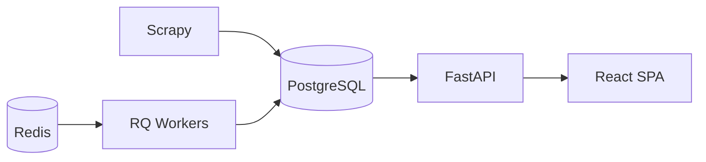

<div align="center">

# SkyTrax Analytics

### Global Aviation Intelligence Platform

[](https://www.python.org/)
[](https://fastapi.tiangolo.com/)
[](https://react.dev/)
[](https://www.postgresql.org/)
[](https://docs.docker.com/compose/)
[](LICENSE)
[](.github/workflows/ci.yml)

**Plataforma de Inteligência Analítica para o setor de aviação** — baseada em dados operacionais, reputacionais e experiência do passageiro.

*Global Aviation Intelligence Platform*

[Quick Start](#quick-start) · [Architecture](#architecture) · [Features](#features) · [API](#main-api-endpoints) · [Roadmap](#roadmap)

</div>

---

## Visão geral

**SkyTrax Analytics** integra múltiplas fontes aeronáuticas e sinais de reputação em um único centro de comando analítico, com coleta automatizada, enriquecimento de metadados e workspaces operacionais em tempo real.

### O sistema integra

- **Reviews da AirlineQuality** — corpus unificado de avaliações de passageiros
- **Metadados globais de companhias aéreas** — registro operacional e enriquecimento (`airline_metadata`)
- **Metadados aeroportuários** — cobertura global de aeroportos (`airport_metadata`)
- **Alianças aéreas** — Star Alliance, SkyTeam, Oneworld e vínculos de rede
- **Hubs operacionais** — classificação, rankings, risco e concentração
- **Análise semântica** — tópicos, entidades e busca vetorial (pgvector)
- **Benchmarking competitivo** — comparação entre pares e heatmaps
- **Investigação operacional** — correlação multi-sinal e feed de incidentes
- **Geoespacial** — mapa operacional com camadas MapLibre / Deck.gl

Stack: **FastAPI** · **React** · **PostgreSQL + pgvector** · **Redis/RQ** · **Scrapy**

---

## Features

| Módulo | Capacidade |
|--------|------------|
| **Executive Intelligence** | KPIs, insights e timeline operacional |
| **Reputation Monitoring** | Airline Reputation Score (ARS) e drill-down |
| **Semantic Intelligence** | Clusters, entidades, busca vetorial |
| **Benchmarking** | Comparação competitiva e heatmaps |
| **Aviation Domain** | Registro de airlines, airports e catálogo |
| **Hub Intelligence** | Rankings, matriz de risco, concentração |
| **Alliance Intelligence** | Panorama, comparativo e rede de hubs |
| **Investigations** | Correlação multi-sinal |
| **Geospatial** | Mapa operacional global |

Módulos adicionais: **Forecasting**, **Anomaly Detection**, **Coverage Audit**.

---

## Architecture

### Frontend

- **React** 18 — modular workspaces (Executive, Aviation, Hubs, Alliances, …)
- **Vite** — dev server and production bundling
- **ECharts**, **MapLibre**, **Deck.gl** — charts and geospatial layers

### Backend

- **FastAPI** — REST API with OpenAPI (`/docs`)
- **Pydantic** + **SQLAlchemy** + **Alembic** — contracts, ORM, migrations

### Database

- **PostgreSQL** 16 — primary datastore
- **pgvector** — semantic embeddings and similarity search
- **PostGIS** — optional geospatial extensions

### Workers

- **Redis** — queue broker
- **RQ** — async jobs (NLP, forecasting, pipeline orchestration)

### Collection

- **Scrapy** — review and metadata spiders (`airlinequality_reviews`, aviation metadata)

### Analytics

- **scikit-learn** — clustering, statistical models
- **Sentence Transformers** — optional embeddings (`NLP_ENABLE_EMBEDDINGS`)



Detailed docs: [docs/architecture/architecture.md](docs/architecture/architecture.md)

---

## Current dataset

Representative counts from a populated development database ([API audit](docs/audits/API_AUDIT.md)):

| Entity | Count |
|--------|------:|
| **Airlines** (metadata) | 1,560 |
| **Airports** (metadata) | 6,292 |
| **Alliances** | 3 |
| **Hubs** (classified) | 1,361 |
| **Reviews** | 28,113+ |

Core `airlines` table: 584 active records · `airline_airports` links: 9,693.

---

## Main API endpoints

All aviation dashboards consume routes under **`/api/aviation/*`**.

| Method | Endpoint | Description |
|--------|----------|-------------|
| `GET` | `/api/aviation/catalog` | Bundle: metadata + airlines + airports + alliances + hubs |
| `GET` | `/api/aviation/hubs` | Hub registry (classified airports + links) |
| `GET` | `/api/aviation/alliances` | Alliance members, ratings, risk |
| `GET` | `/api/aviation/coverage` | Coverage score, orphans, completeness |

**Examples**

```bash
curl -s "http://localhost:8000/api/aviation/catalog?airline_limit=10" | jq '.metadata'
curl -s "http://localhost:8000/api/aviation/hubs" | jq 'length'
curl -s "http://localhost:8000/api/aviation/alliances" | jq '.[].name'
curl -s "http://localhost:8000/api/aviation/coverage" | jq '{airlines: .total_airlines, score: .coverage_score}'
```

Other surfaces: `/api/intelligence/*`, `/api/forecasting/*`, `/api/anomalies/*`, `/api/search/*`, `/api/operations/*`.

Health: `GET /health` · Docs: `GET /docs` · Metrics: `GET /metrics`

---

## Quick Start

### Installation (local prerequisites)

- Docker 24+ with Compose v2 **recommended**, or
- Python 3.11+, Node 20+, PostgreSQL 16 (pgvector), Redis 7

```bash
git clone https://github.com/willianpina/SkyTrax_Project.git
cd SkyTrax_Project
cp .env.example .env
```

### Docker

```bash
docker compose up --build
```

Initialize schema and seed data:

```bash
docker compose exec app alembic upgrade head
docker compose exec app python scripts/seed_airlines.py
docker compose exec app scrapy crawl airlinequality_reviews -a max_pages=3
```

Optional aviation enrichment:

```bash
curl -X POST http://localhost:8000/api/aviation/propagate
```

| Service | URL |
|---------|-----|
| API | http://localhost:8000 |
| Swagger | http://localhost:8000/docs |
| Dashboard | http://localhost:5173 |
| Health | http://localhost:8000/health |

> **Tip:** In Docker, set `VITE_API_BASE=/api` so the frontend uses the Vite proxy. See [docs/frontend/README.md](docs/frontend/README.md).

### Development

**Backend**

```bash
python3 -m venv .venv && source .venv/bin/activate
pip install -r requirements-dev.txt
alembic upgrade head
uvicorn main:app --reload --port 8000
```

**Frontend**

```bash
cd frontend && npm install && npm run dev
```

**Makefile**

```bash
make help    # list commands
make dev     # docker compose up
make lint    # ruff check + format check
make test    # pytest via compose
make smoke   # API smoke test
```

---

## CI/CD

GitHub Actions: [`.github/workflows/ci.yml`](.github/workflows/ci.yml)

| Stage | Tool | Description |
|-------|------|-------------|
| Lint | **Ruff** | `ruff check .` + `ruff format --check .` |
| Test | **Pytest** | Migrations + full suite, coverage ≥ 45% |
| Frontend | **npm** | `npm ci` + `npm run build` |
| Docker | **Compose** | Config validation + image build |
| Security | **pip-audit** | Dependency advisory scan (non-blocking) |

Local validation:

```bash
ruff check . && ruff format --check .
bash scripts/ci_smoke.sh
cd frontend && npm run build
```

Release reports: [docs/release/](docs/release/)

---

## Security Audit

The project runs **pip-audit** on every CI execution against `requirements.txt`.

The security job currently operates in **advisory-only** mode during the platform stabilization phase: findings are printed to the workflow log and surfaced as GitHub warnings, but they **do not fail the pipeline**.

Identified vulnerabilities are tracked in:

- [docs/security/DEPENDENCY_AUDIT.md](docs/security/DEPENDENCY_AUDIT.md)
- [docs/security/UPGRADE_PLAN.md](docs/security/UPGRADE_PLAN.md)
- [docs/security/SECURITY_RELEASE_REPORT.md](docs/security/SECURITY_RELEASE_REPORT.md)

Local run:

```bash
pip install pip-audit
pip-audit -r requirements.txt
```

---

## Roadmap

| Initiative | Status |
|------------|--------|
| **Geospatial Intelligence** | 🚧 Map workspace live; interactive graph planned |
| **Predictive Reputation** | 🚧 Forecasting module live; model expansion planned |
| **LLM Insights** | 📋 Executive copilot and RAG enhancements |
| **Multi-language Analytics** | 📋 Extended i18n and corpus language detection |
| **Advanced Hub Analytics** | 🚧 Rankings, risk, concentration live; graph view planned |

Version history: [docs/roadmap/roadmap.md](docs/roadmap/roadmap.md)

---

## Screenshots

Portfolio screenshots belong in `docs/screenshots/`. See [docs/screenshots/README.md](docs/screenshots/README.md) for naming conventions.

| Module | File |
|--------|------|
| Executive | `docs/screenshots/executive.png` |
| Aviation | `docs/screenshots/aviation.png` |
| Hubs | `docs/screenshots/hubs.png` |
| Alliances | `docs/screenshots/alliances.png` |

---

## Documentation

| Guide | Link |
|-------|------|
| Architecture | [docs/architecture/](docs/architecture/) |
| Backend | [docs/backend/README.md](docs/backend/README.md) |
| Frontend | [docs/frontend/README.md](docs/frontend/README.md) |
| Deployment | [docs/deployment/deployment.md](docs/deployment/deployment.md) |
| Release audits | [docs/release/](docs/release/) |

---

## Contributing

See [CONTRIBUTING.md](CONTRIBUTING.md) and [CODE_OF_CONDUCT.md](CODE_OF_CONDUCT.md). Security: [SECURITY.md](SECURITY.md).

---

## License

[MIT License](LICENSE)
