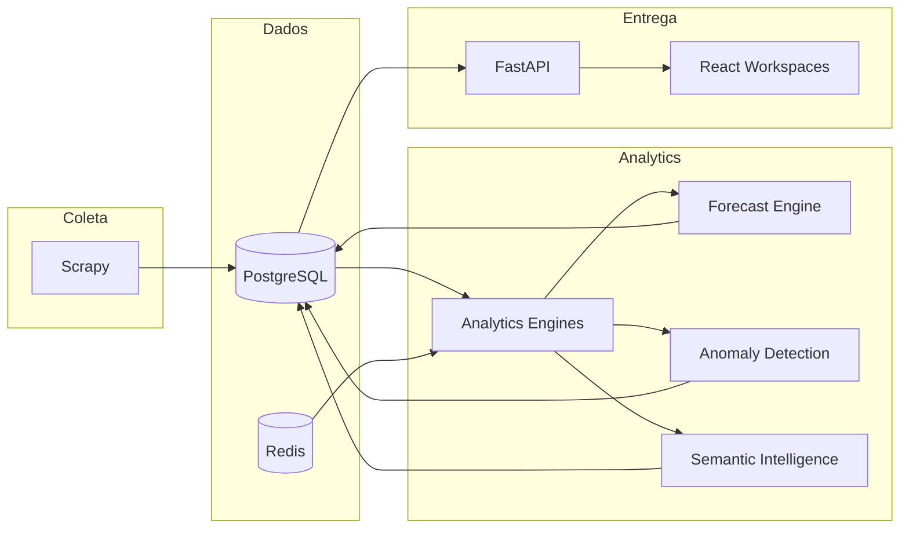

# SkyTrax Analytics

Plataforma de **inteligência analítica** para companhias aéreas — reputação, previsão, anomalias, semântica e rede de aviação em um único centro de comando operacional.


---

## Visão geral

O **SkyTrax Analytics** transforma avaliações de passageiros, metadados aeronáuticos e sinais operacionais em **inteligência acionável** para equipes de experiência do cliente, operações e estratégia.

| Problema | Solução SkyTrax |
|----------|-----------------|
| Feedback disperso em múltiplas fontes | Coleta Scrapy + corpus unificado em PostgreSQL |
| Reação tardia a crises reputacionais | Detecção de anomalias e forecasting proativo |
| Falta de contexto semântico | NLP, clusters temáticos e busca vetorial (pgvector) |
| Visão fragmentada da rede | Workspaces de aviação, hubs, alianças e mapa geoespacial |

---

## Arquitetura



Documentação detalhada: [docs/architecture/diagram.md](docs/architecture/diagram.md) · [docs/architecture/architecture.md](docs/architecture/architecture.md)

---

## Tecnologias

| Camada | Stack |
|--------|-------|
| **API** | FastAPI, Pydantic, SQLAlchemy, Alembic |
| **Banco** | PostgreSQL, pgvector, PostGIS (opcional) |
| **Filas** | Redis, RQ |
| **Coleta** | Scrapy (+ Playwright opcional) |
| **NLP** | spaCy, scikit-learn, sentence-transformers (opcional) |
| **Frontend** | React 18, Vite, ECharts, MapLibre, Deck.gl, Tailwind |
| **Ops** | Docker Compose, Prometheus, Grafana |

---

## Estrutura do projeto

```text
SkyTrax_Project/
├── api/                 # REST API FastAPI
├── analytics/           # Engines analíticos
├── app/                 # Config, middleware, observability
├── aviation/            # Master data de aviação
├── database/            # ORM + migrations Alembic
├── frontend/            # SPA React (workspaces)
├── scraper/             # Spiders Scrapy
├── worker/              # Jobs RQ e orchestration
├── tests/               # Pytest (258 testes)
├── docs/                # Documentação técnica
│   ├── architecture/
│   ├── backend/
│   ├── deployment/
│   ├── frontend/
│   └── testing/
└── .github/workflows/   # CI GitHub Actions
```

---

## Instalação local

### Pré-requisitos

- Docker 24+ e Compose v2 **ou**
- Python 3.11+, Node 20+, PostgreSQL 16 com pgvector, Redis 7

### Opção A — Docker (recomendado)

```bash
git clone https://github.com/willianpina/SkyTrax_Project.git
cd SkyTrax_Project
cp .env.example .env
docker compose up --build
```

Inicializar dados:

```bash
docker compose exec app alembic upgrade head
docker compose exec app python scripts/seed_airlines.py
docker compose exec app scrapy crawl airlinequality_reviews -a max_pages=3
```

### Opção B — Desenvolvimento nativo

**Backend**

```bash
python3 -m venv .venv && source .venv/bin/activate
pip install -r requirements-dev.txt
cp .env.example .env
alembic upgrade head
uvicorn main:app --reload --port 8000
```

**Frontend**

```bash
cd frontend
npm install
npm run dev
```

| Serviço | URL |
|---------|-----|
| API | http://localhost:8000 |
| Swagger | http://localhost:8000/docs |
| Dashboard (dev) | http://localhost:5173 |
| Health | http://localhost:8000/health |

---

## Execução com Docker

```bash
# Desenvolvimento
docker compose up --build

# Produção
cp .env.example .env
docker compose -f docker-compose.prod.yml up --build -d
```

Guia completo: [docs/deployment/deployment.md](docs/deployment/deployment.md)

---

## GitHub Actions

Workflow: [`.github/workflows/ci.yml`](.github/workflows/ci.yml)

| Job | Descrição |
|-----|-----------|
| `lint` | Ruff, format, import smoke, Scrapy list |
| `frontend` | `npm ci` + `npm run build` |
| `test` | Alembic + pytest com cobertura ≥ 45% |
| `docker` | Validação e build das imagens |
| `security` | `pip-audit` (advisory) |

Validar localmente:

```bash
bash scripts/ci_smoke.sh
```

Documentação CI: [docs/ci_cd/README.md](docs/ci_cd/README.md)

---

## Principais módulos

| Módulo | Capacidade |
|--------|------------|
| **Executive** | ARS, insights, timeline operacional |
| **Forecasting** | Projeção de reputação e heatmaps |
| **Benchmarking** | Comparação entre companhias |
| **Anomalies** | Desvios estatísticos e alertas |
| **Semantic** | Clusters, entidades, busca vetorial |
| **Aviation / Hubs / Alliances** | Rede global, concentração, alianças |
| **Geospatial** | Mapa operacional Deck.gl |
| **Investigations** | Correlação multi-sinal |

---

## Screenshots

Adicione capturas em `docs/screenshots/` antes do release público.

| Módulo | Arquivo |
|--------|---------|
| Executive | `docs/screenshots/executive.png` |
| Forecasting | `docs/screenshots/forecasting.png` |
| Anomalies | `docs/screenshots/anomalies.png` |
| Semantic | `docs/screenshots/semantic.png` |
| Hubs | `docs/screenshots/hubs.png` |

---

## Roadmap

| Versão | Entrega |
|--------|---------|
| **v1** | Dashboard executivo, reputação, coleta Scrapy |
| **v2** | Forecasting, anomalias, benchmarking |
| **v3** | Semantic Intelligence, busca vetorial |
| **v4** | Network Intelligence (aviação, hubs, geo) |
| **v5** | Enterprise (auth, alertas, E2E) — planejado |

Detalhes: [docs/roadmap/roadmap.md](docs/roadmap/roadmap.md)

---

## Documentação

| Guia | Link |
|------|------|
| Arquitetura | [docs/architecture/](docs/architecture/) |
| Backend | [docs/backend/README.md](docs/backend/README.md) |
| Frontend | [docs/frontend/README.md](docs/frontend/README.md) |
| Testes | [docs/testing/README.md](docs/testing/README.md) |
| Deploy | [docs/deployment/deployment.md](docs/deployment/deployment.md) |
| Maturidade / auditoria | [docs/MATURITY_REPORT.md](docs/MATURITY_REPORT.md) |

---

## Desenvolvimento

```bash
make help           # comandos disponíveis
make lint           # ruff
make test           # pytest via Docker
make frontend-dev   # Vite :5173
```

---

## Contribuir

Leia [CONTRIBUTING.md](CONTRIBUTING.md) e o [Código de Conduta](CODE_OF_CONDUCT.md).

---

## Licença

Este projeto está licenciado sob a **MIT License** — veja [LICENSE](LICENSE).
