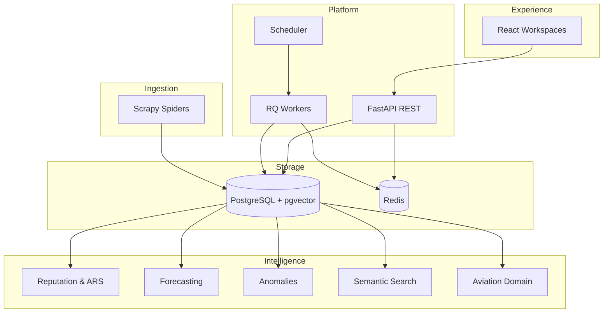

<div align="center">

# SkyTrax Analytics

**Airline intelligence platform** — reputation, forecasting, anomalies, semantic search, and global aviation network analytics in a single operational command center.

[](https://www.python.org/)
[](https://fastapi.tiangolo.com/)
[](https://react.dev/)
[](https://www.postgresql.org/)
[](https://docs.docker.com/compose/)
[](LICENSE)
[](.github/workflows/ci.yml)

[Quick Start](#quick-start) · [Architecture](#architecture) · [Features](#features) · [API](#api) · [Docs](#documentation) · [Roadmap](#roadmap)

</div>

---

## Hero

SkyTrax transforms passenger reviews, aviation master data, and operational signals into **actionable intelligence** for customer experience, operations, and strategy teams.

| Challenge | SkyTrax response |
|-----------|------------------|
| Fragmented feedback across sources | Scrapy ingestion → unified PostgreSQL corpus |
| Late reaction to reputation crises | Anomaly detection + forecasting |
| Lack of semantic context | NLP pipelines, topic clusters, pgvector search |
| Siloed network view | Aviation, hubs, alliances, coverage & geospatial workspaces |

**Current dataset (typical dev environment):** ~28k reviews · 584 airlines · 1.5k airline metadata · 6.3k airports · 3 global alliances.

---

## Architecture



| Layer | Stack |
|-------|-------|
| **API** | FastAPI, Pydantic, SQLAlchemy, Alembic |
| **Data** | PostgreSQL 16, pgvector, PostGIS (optional) |
| **Queues** | Redis, RQ |
| **Ingestion** | Scrapy (+ Playwright optional) |
| **NLP** | spaCy, scikit-learn, sentence-transformers (optional) |
| **Frontend** | React 18, Vite, ECharts, MapLibre, Deck.gl |
| **Ops** | Docker Compose, Prometheus, Grafana |

Deep dive: [docs/architecture/architecture.md](docs/architecture/architecture.md) · [diagram](docs/architecture/diagram.md) · [project structure audit](docs/architecture/PROJECT_STRUCTURE.md)

---

## Features

### Executive & reputation

- **Executive workspace** — KPIs, insights, operational timeline
- **Reputation scoring (ARS)** — composite airline reputation index
- **Benchmarking** — peer comparison, heatmaps, radar analytics

### Predictive & alerts

- **Forecasting** — EWMA, temporal heatmaps, top movers
- **Anomaly detection** — statistical deviation feed with severity

### Semantic intelligence

- **Topic trends** and entity extraction
- **Vector search** (pgvector) and semantic clusters
- **Investigations** — multi-signal correlation workspace

### Network intelligence

- **Aviation registry** — airlines, airports, metadata catalog
- **Hub intelligence** — rankings, risk matrix, concentration, incidents
- **Alliances** — panorama, comparison, network analytics
- **Coverage engine** — completeness, orphans, duplicates, graph readiness
- **Geospatial** — operational map (MapLibre + Deck.gl)

---

## Screenshots

> Add PNG captures under `docs/screenshots/` before a public portfolio release.  
> See [docs/screenshots/README.md](docs/screenshots/README.md) for naming conventions.

| Module | File (planned) |
|--------|----------------|
| Executive | `docs/screenshots/executive.png` |
| Forecasting | `docs/screenshots/forecasting.png` |
| Anomalies | `docs/screenshots/anomalies.png` |
| Semantic | `docs/screenshots/semantic.png` |
| Aviation | `docs/screenshots/aviation.png` |
| Hubs | `docs/screenshots/hubs.png` |
| Alliances | `docs/screenshots/alliances.png` |
| Coverage | `docs/screenshots/coverage.png` |
| Geospatial | `docs/screenshots/geospatial.png` |

---

## API

Base URL (dev): `http://localhost:8000`

| Resource | Path | Description |
|----------|------|-------------|
| Health | `GET /health` | Service status |
| OpenAPI | `GET /docs` | Swagger UI |
| Reviews | `GET /api/reviews`, `/api/airlines` | Core corpus |
| Intelligence | `GET /api/intelligence/*` | Reputation, benchmarking, insights |
| Forecasting | `GET /api/forecasting/*` | Predictions |
| Anomalies | `GET /api/anomalies/*` | Anomaly events |
| Search | `GET /api/search/*` | Semantic search & clusters |
| **Aviation** | `GET /api/aviation/*` | Catalog, hubs, alliances, coverage |
| Operations | `GET /api/operations/*` | Pipeline sync, status, refresh |
| Metrics | `GET /metrics` | Prometheus |

**Aviation bundle (dashboards):**

```bash
curl -s "http://localhost:8000/api/aviation/catalog?airline_limit=100&airport_limit=200" | jq '.metadata'
curl -s "http://localhost:8000/api/aviation/alliances" | jq 'length'
curl -s "http://localhost:8000/api/aviation/coverage" | jq '{airlines: .total_airlines, score: .coverage_score}'
```

> Note: There are no top-level `/api/hubs` or `/api/alliances` routes — all aviation data lives under `/api/aviation/*`.

---

## Installation

### Prerequisites

- **Docker** 24+ with Compose v2 (recommended), **or**
- Python 3.11+, Node 20+, PostgreSQL 16 (pgvector), Redis 7

### Environment

```bash
git clone https://github.com/willianpina/SkyTrax_Project.git
cd SkyTrax_Project
cp .env.example .env
```

Key variables: `DATABASE_URL`, `REDIS_URL`, `VITE_API_BASE` (use `/api` with Docker frontend proxy).

---

## Quick Start

### Docker (recommended)

```bash
docker compose up --build
```

Initialize schema and sample data:

```bash
docker compose exec app alembic upgrade head
docker compose exec app python scripts/seed_airlines.py
docker compose exec app scrapy crawl airlinequality_reviews -a max_pages=3
```

Optional aviation bootstrap:

```bash
docker compose exec app python scripts/bootstrap_aviation.py
# or trigger via API:
curl -X POST http://localhost:8000/api/aviation/propagate
```

| Service | URL |
|---------|-----|
| API | http://localhost:8000 |
| Swagger | http://localhost:8000/docs |
| Dashboard | http://localhost:5173 |
| Health | http://localhost:8000/health |
| RQ Dashboard | http://localhost:9181 |

### Native development

**Backend**

```bash
python3 -m venv .venv && source .venv/bin/activate
pip install -r requirements-dev.txt
cp .env.example .env
alembic upgrade head
uvicorn main:app --reload --port 8000
```

**Frontend**

```bash
cd frontend && npm install && npm run dev
```

**Makefile shortcuts**

```bash
make help          # all targets
make dev           # docker compose up
make test          # pytest via compose
make lint          # ruff
make frontend-dev  # Vite on :5173
make smoke         # API smoke test
```

---

## Project structure

```text
SkyTrax_Project/
├── api/              # FastAPI routers
├── app/              # Config, middleware, observability
├── analytics/        # Intelligence engines
├── aviation/         # Aviation domain (master data, coverage, hubs)
├── database/         # ORM + Alembic migrations
├── scraper/          # Scrapy spiders & pipelines
├── worker/           # RQ jobs & pipeline orchestration
├── frontend/         # React workspaces (SPA)
├── tests/            # Pytest (~262 tests)
├── scripts/          # Seed, bootstrap, audit, smoke
├── docs/             # Architecture, audits, deployment
└── ops/              # Prometheus & Grafana
```

Full audit: [docs/architecture/PROJECT_STRUCTURE.md](docs/architecture/PROJECT_STRUCTURE.md)  
Target layout (proposal): [docs/architecture/TARGET_STRUCTURE.md](docs/architecture/TARGET_STRUCTURE.md)

---

## CI/CD

GitHub Actions workflow: [`.github/workflows/ci.yml`](.github/workflows/ci.yml)

| Job | Description |
|-----|-------------|
| **lint** | Ruff check + format, import smoke, Scrapy list |
| **frontend** | `npm ci` + production build |
| **test** | Alembic migrate + pytest with **≥45%** coverage |
| **docker** | Compose validate + image build |
| **security** | `pip-audit` (advisory) |

Local validation:

```bash
bash scripts/ci_smoke.sh
ruff check .
cd frontend && npm run build
```

Health report: [docs/release/PROJECT_HEALTH_REPORT.md](docs/release/PROJECT_HEALTH_REPORT.md)

---

## Dataset statistics

Representative counts from a populated dev database ([API audit](docs/audits/API_AUDIT.md)):

| Entity | Count |
|--------|------:|
| Reviews | 28,113 |
| Airlines (core) | 584 |
| Airline metadata | 1,560 |
| Airport metadata | 6,292 |
| Alliances | 3 |
| Airline–airport links | 9,693 |
| Classified hubs | 1,361 |

---

## Roadmap

| Version | Focus | Status |
|---------|-------|--------|
| **v1** | Executive dashboard, reputation, Scrapy ingestion | ✅ |
| **v2** | Forecasting, anomalies, benchmarking | ✅ |
| **v3** | Semantic intelligence, vector search | ✅ |
| **v4** | Network intelligence (aviation, hubs, geo) | 🚧 |
| **v5** | Enterprise (auth, alerts, E2E tests) | 📋 Planned |
| **v6** | Multi-tenant SaaS, API keys | 📋 Future |

Details: [docs/roadmap/roadmap.md](docs/roadmap/roadmap.md)

---

## Documentation

| Guide | Link |
|-------|------|
| Architecture | [docs/architecture/](docs/architecture/) |
| Backend | [docs/backend/README.md](docs/backend/README.md) |
| Frontend | [docs/frontend/README.md](docs/frontend/README.md) |
| Testing | [docs/testing/README.md](docs/testing/README.md) |
| Deployment | [docs/deployment/deployment.md](docs/deployment/deployment.md) |
| CI/CD | [docs/ci_cd/README.md](docs/ci_cd/README.md) |
| Audits | [docs/audits/](docs/audits/) |
| Health report | [docs/release/PROJECT_HEALTH_REPORT.md](docs/release/PROJECT_HEALTH_REPORT.md) |

---

## Contributing

Contributions are welcome. Please read [CONTRIBUTING.md](CONTRIBUTING.md) and our [Code of Conduct](CODE_OF_CONDUCT.md).

Security issues: see [SECURITY.md](SECURITY.md).

---

## License

This project is licensed under the [MIT License](LICENSE).

---

<div align="center">

**SkyTrax Analytics** — turning passenger voice into airline intelligence.

</div>
